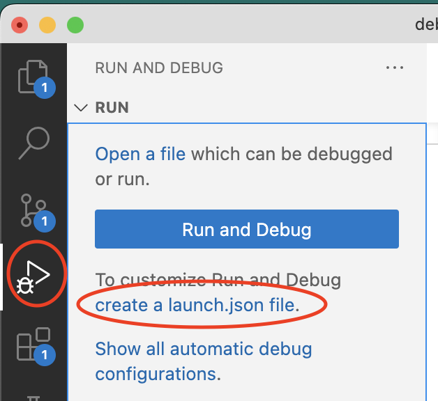
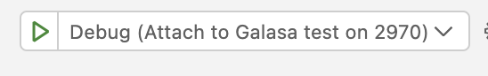
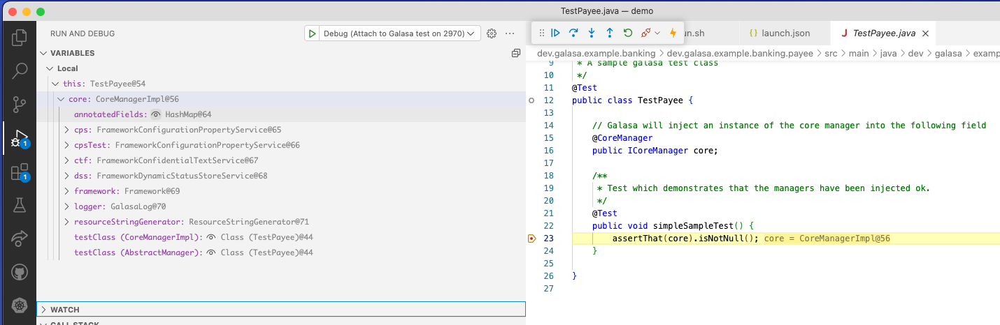

# Debug a local Galasa test within Microsoft vscode


## Prepare to launch the java debugger
Make sure you have the ["Debugger for Java" plugin](https://github.com/microsoft/vscode-java-debug) installed, from Microsoft.

Add the following text to your ${workspace}/.vscode/
```
{
    "version": "0.2.0",
    "configurations": [
    {
        "type": "java",
        "name": "Debug (Attach to Galasa test on 2970)",
        "projectName": "banking",
        "request": "attach",
        "hostName": "localhost",
        "port": 2970
    }
    ]
}
```

This can be done manually, or you can use the "create a launch.json" file which is available when you open the "Run and Debug" side-bar view, as in this diagram:


Note: The `port` 2970 matches the default used by the `galasactl runs submit local --debug ...` command. i.e: The port must be the same so that the IDE debugger and the testcase JVM can agree which port they will communicate over.

Note: The `request` field with a value of `attach` can be paired with the default of `listen` used by the `galasactl runs submit local --debug ...` command. i.e: Each tool must be configured with the opposite value, so one listens to the port, and the other attaches to it.

## Launching a galasa test in the debugger

### Set a breakpoint in your code
Make sure the test code source is loaded into the vscode workspace.

Use the IDE to set a breakpoint within the test code you intend to debug.

### Launch the Galasa test
(Assuming the settings for the IDE are 'attach' and the settings for `galasactl` are `listen`)

Run the `galasactl runs submit local --debug ...` command first.

(If the settings are the other way around, launch the IDE first)
ie: The side configured to `listen` on the port should be started first.

The Galasa test will pause waiting for the debugger to connect to the port it is listening on.

### Launch the debugger within the IDE

Switch to the "Run and Debug" side-panel provided by the Java Debugging plugin.

Note the drop-down at the top of the panel, offering-up your
configured launch settings.

For example, our example configuration is called "Debug (Attach to Galasa test on 2970)"


Select the launch configuration matching that used by the `galasactl` tool.

Hit the "run" symbol (right-pointing green triangle) on the left side of the launch selection tool.

The JVM should resume execution, and run up to the point where your breakpoint is set, and stop.

The IDE should show you the variables in use, and display the line of code where execution has reached.

Like this: 


Use the debugger controls to control the execution of the testcase. 

